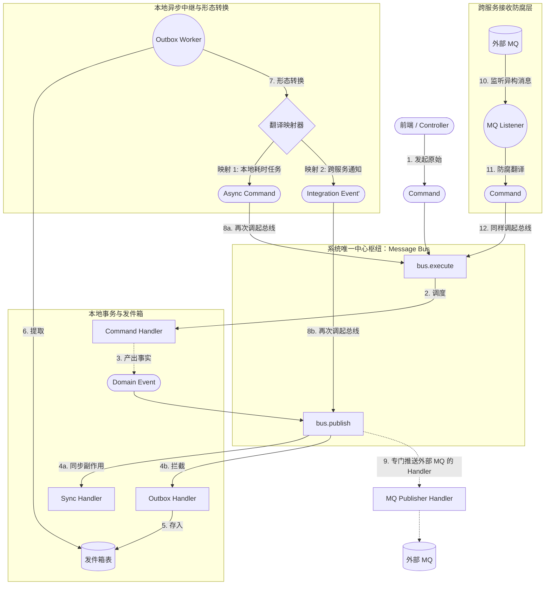

```mermaid
graph TD
    subgraph CoreBus [系统唯一中心枢纽：Message Bus]
        Execute[bus.execute]
        Publish[bus.publish]
    end

    API([前端 / Controller]) -->|1. 发起原始| CMD_API([Command])
    CMD_API --> Execute

    subgraph Phase1 [本地事务与发件箱]
        Execute -->|2. 调度| CH[Command Handler]
        CH -.->|3. 产出事实| EVT_Domain([Domain Event])
        EVT_Domain --> Publish
        
        Publish -->|4a. 同步副作用| SyncH[Sync Handler]
        Publish -->|4b. 拦截| OH[Outbox Handler]
        OH -->|5. 存入| DB_Outbox[(发件箱表)]
    end

    subgraph Phase2 [本地异步中继与形态转换]
        Worker((Outbox Worker)) -->|6. 提取| DB_Outbox
        Worker -->|7. 形态转换| Transform{翻译映射器}
        
        Transform -->|映射 1: 本地耗时任务| CMD_Async([Async Command])
        Transform -->|映射 2: 跨服务通知| EVT_Int([Integration Event'])
        
        CMD_Async -->|8a. 再次调起总线| Execute
        EVT_Int -->|8b. 再次调起总线| Publish
    end
    
    Publish -.->|9. 专门推送外部 MQ 的 Handler| ExternalPushH[MQ Publisher Handler]
    ExternalPushH -.-> MQ_Out[(外部 MQ)]

    subgraph Phase3 [跨服务接收防腐层]
        MQ_In[(外部 MQ)] -->|10. 监听异构消息| Listener((MQ Listener))
        Listener -->|11. 防腐翻译| CMD_Ext([Command])
        
        CMD_Ext -->|12. 同样调起总线| Execute
    end
```